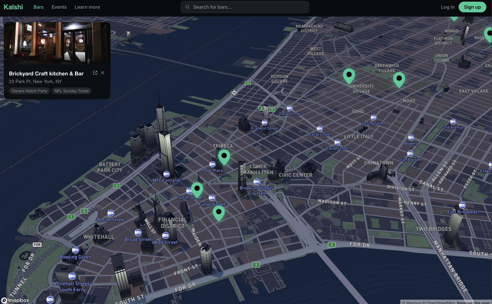
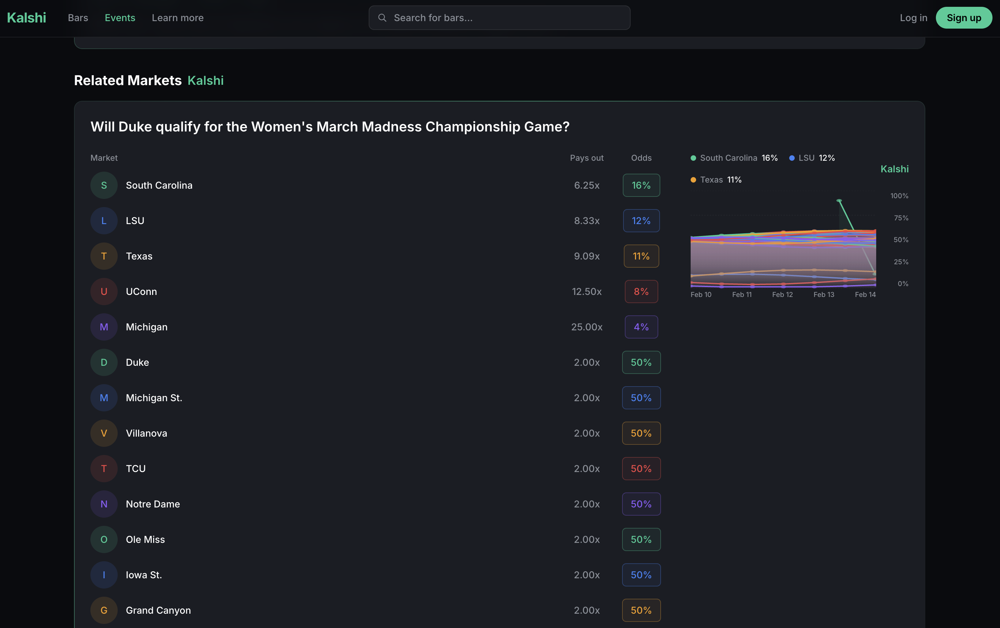
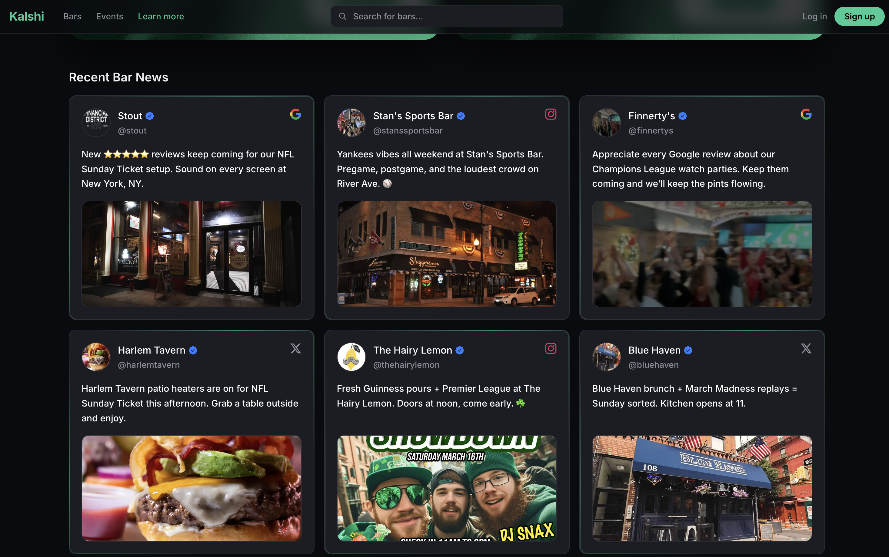

# Kalshi's Bar Platform

A curated discovery experience for sports bars and event watch parties, with live Kalshi market snapshots and a map-first UI.

## Pictures of App

### Map View


### Related Markets


### Reviews From Google/X/Yelp


## Kalshi's Bar Platform
- Map-driven bar discovery with rich cards and event badges
- Event detail pages with related Kalshi markets and charts
- Optimized image rendering and consistent card layouts
- SEO + social preview metadata (Open Graph + Twitter)

## Made With ❤️
- Next.js (App Router)
- Tailwind CSS
- Hono + Bun backend for Kalshi API proxying
- Mapbox GL


## To Run Locally

### Frontend
```bash
cd frontend
npm install
npm run dev
```

### Backend
```bash
cd backend
npm install
npm run dev
```


## License
MIT
